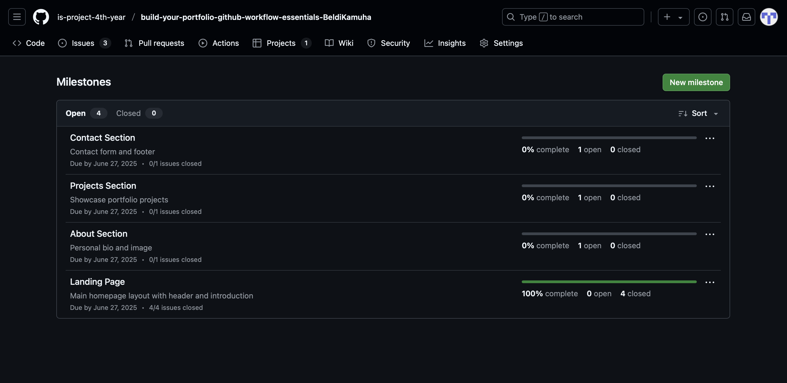
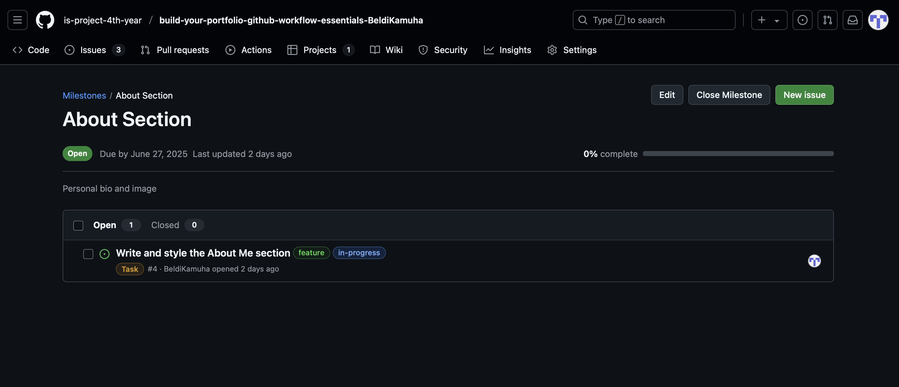
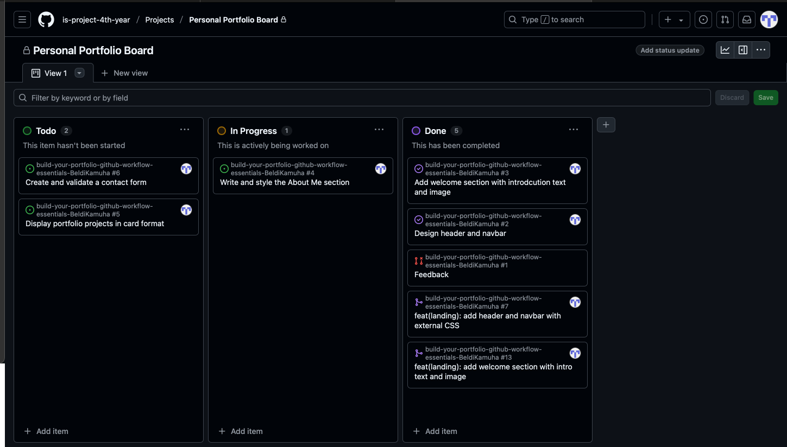
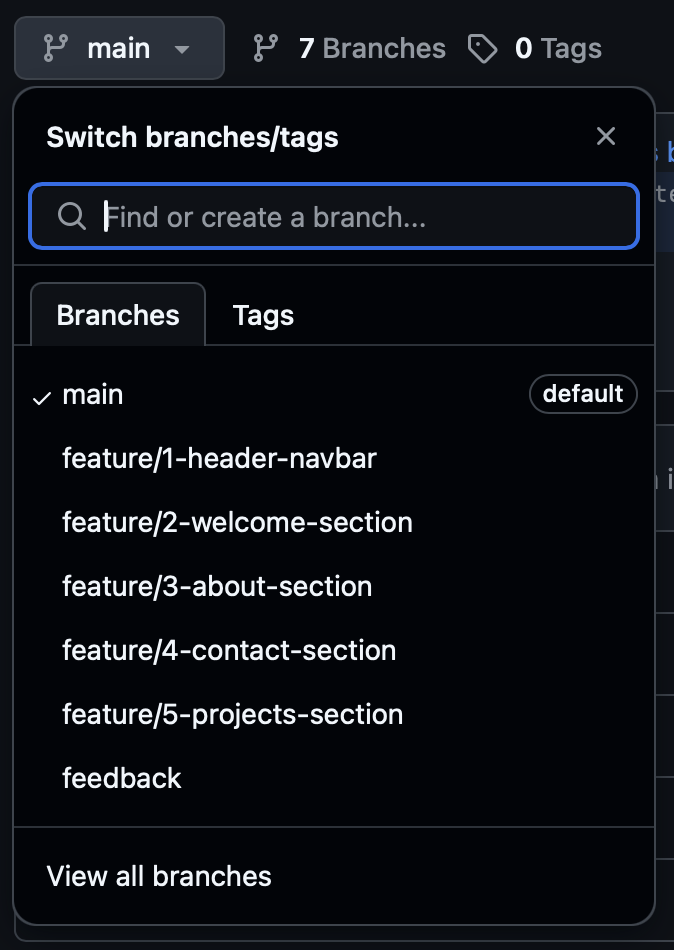
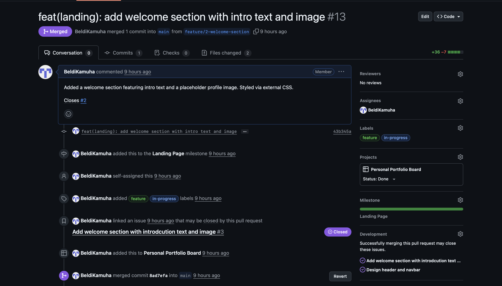
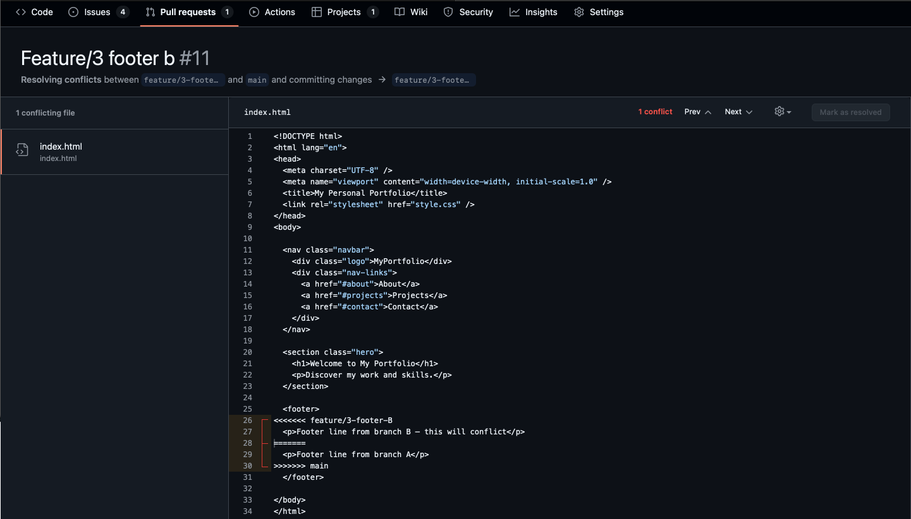
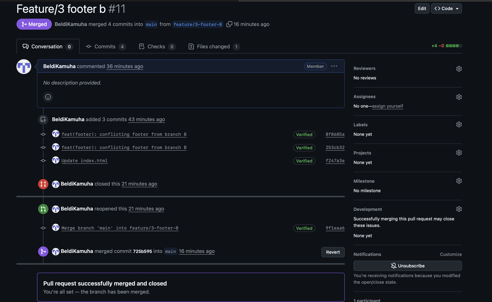

# Personal Portfolio Documentation

## 1. Student Details

- **Full Name**: Beldi Muhindo Kamuha
- **GitHub Username**: BeldiKamuha
- **Email**: muhindo.beldi@strathmore.edu

## 2. Deployed Portfolio Link

- **GitHub Pages URL**:  
  https://is-project-4th-year.github.io/build-your-portfolio-github-workflow-essentials-BeldiKamuha/

## 3. Learnings from the Git Crash Program

- **Branching:**  
Helped me separate features and prevent conflicts when working on different sections of the site.

- **Pull Requests:**  
Taught me to collaborate safely by reviewing and merging changes without affecting the main branch.

- **Project Boards & Issues:**  
Improved task management by breaking work into clear milestones and tracking progress visually.

- **Commit Conventions:**  
Helped keep commit history clean and readable using consistent, descriptive messages (e.g., `feat`, `style`, `docs`, etc.)

---
## 4. Screenshots of Key GitHub Features

### A. Milestones and Issues

### B. Project Board

### C. Branching

### D. Pull Requests

### E. Merge Conflict Resolution

